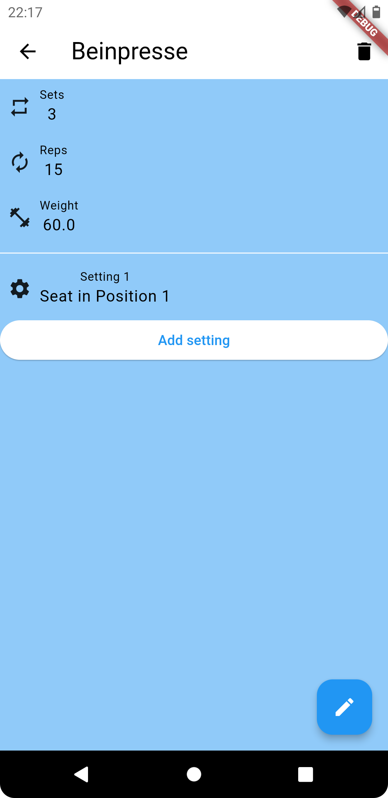
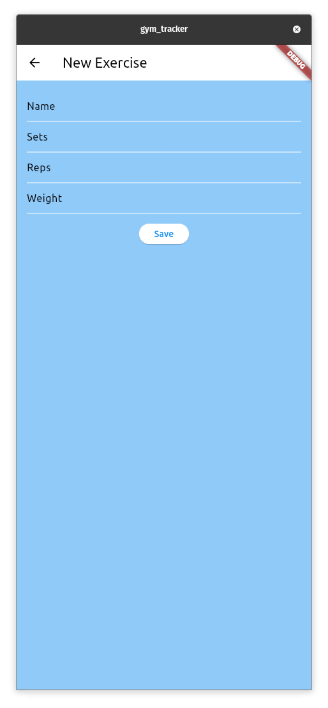

# Gym Tracker

## Description
A simple gym tracker that allows users to track their workouts and progress. Users can create, read, update, and delete workouts and exercises.

They can also add an arbitrary amount of settings for each exercise. 

## Technical Details
This project was built using Dart and Flutter for the app and stores the data in Firebase Firestore.

The sign-in with Google is handled by Firebase Authentication.

## Screenshots

## AI Use
I used heavy inspiration from Bing Image Generator for my Icon, but drew it myself in Inkscape.