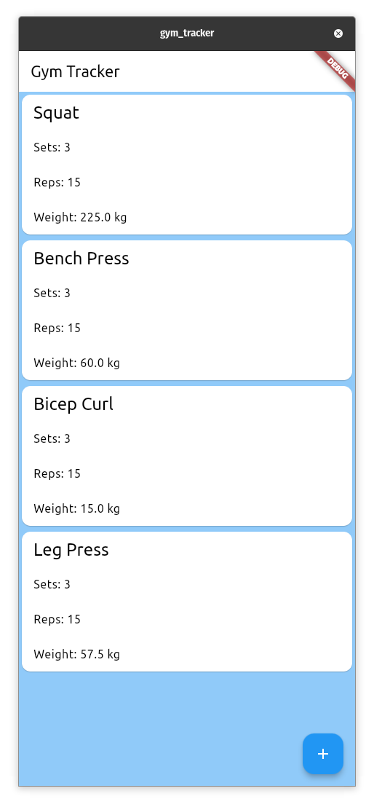

# Gym Tracker

## Description
A simple gym tracker that allows users to track their workouts and progress. Users can create, read, update, and delete workouts and exercises.

## Technical Details
This project was built using Dart and Flutter for the app and stores the data in a local SQLite database.

## Screenshots

